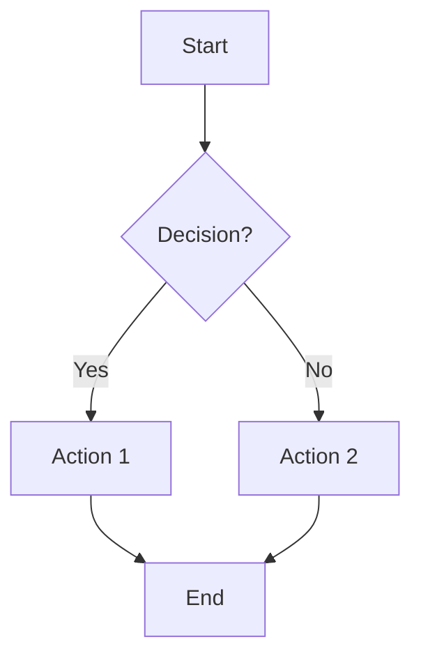
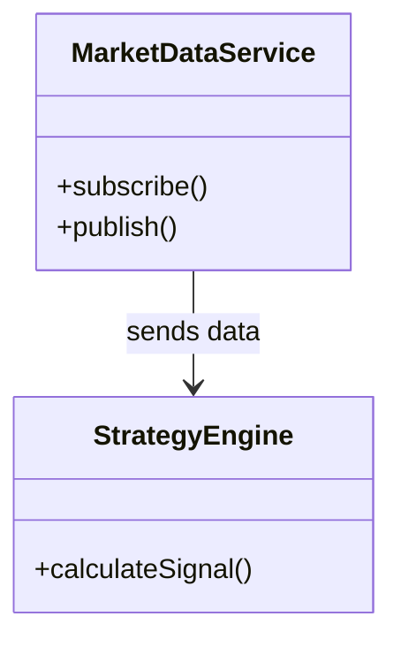
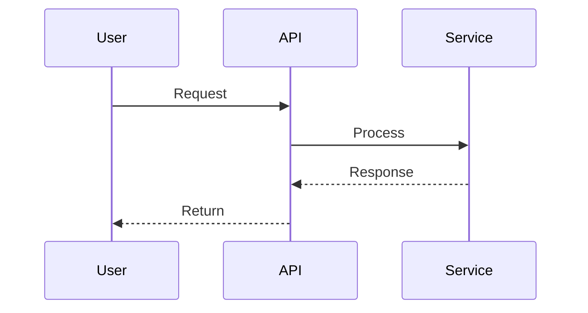
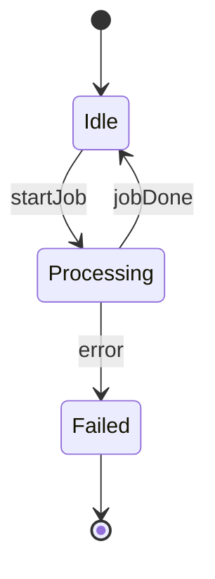
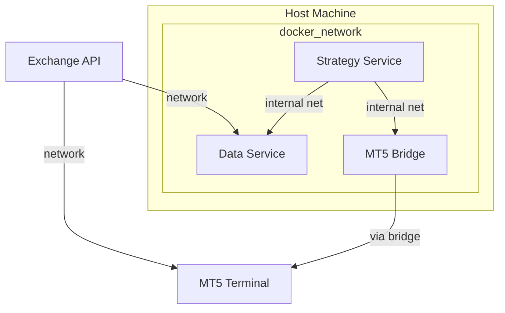

# Mermaid Diagram Generator

## When to Use This Skill
- You have a textual description of a system flow, component layout, or deployment setup.
- You need a diagram that can be pasted directly into Markdown (TaskPlan.md, DeveloperPrompt.md, development_log.md).
- You want to keep diagrams version‑controlled as code.

## How This Skill Works
1. Parse the input description to identify key elements (components, services, data stores, external APIs).
2. Determine the appropriate diagram type (flowchart for processes, component for modular view, sequence for interaction, deployment for infra).
3. Emit valid Mermaid syntax inside a fenced code block.
4. (Optional) Provide a short caption explaining the diagram’s focus.

## Input
- **Description**: A natural‑language or bullet‑point description of the architecture or process to visualise.
- **Diagram type** (optional): One of `flowchart`, `classdiagram`, `sequencediagram`, `statediagram`, `deploymentdiagram`. If omitted, the skill will infer the best type from the description.
- **Direction** (optional): For flowcharts, `TD` (top‑down) or `LR` (left‑right). Default: `TD`.

## Output
- A fenced Markdown code block with the language tag `mermaid` containing a syntactically correct Mermaid diagram.
- No files are created or modified; the skill returns only the diagram text.

## Execution Steps

### Step 1: Analyse the Description
1. Read the supplied description.
2. Extract nouns that represent **entities** (e.g., “Market Data Service”, “Strategy Engine”, “Risk Manager”, “MT5 API”, “PostgreSQL”, “Docker container”).
3. Extract verbs or phrases that represent **relationships** or **data flow** (e.g., “sends data to”, “receives from”, “calls”, “updates”, “triggers”, “stores in”).
4. Identify any explicit grouping (e.g., “inside the Docker network”, “within the Kubernetes pod”).

### Step 2: Choose Diagram Type
- If the description focuses on **steps, decisions, or a process flow** → `flowchart`.
- If it focuses on **static structure, modules, packages, or data stores** → `classdiagram` (or `component` diagram using Mermaid’s `graph` syntax).
- If it focuses on **message exchange over time** → `sequencediagram`.
- If it focuses on **state changes of a single entity** → `statediagram`.
- If it focuses on **physical deployment, nodes, and artifacts** → `deploymentdiagram`.

### Step 3: Generate Mermaid Syntax
Use the following templates as a starting point, filling in the extracted entities and relationships.

#### Flowchart (process flow)


#### Class/Component Diagram (static structure)


#### Sequence Diagram (interaction over time)


#### State Diagram (entity lifecycle)


#### Deployment Diagram (infrastructure)


### Step 4: Emit the Diagram
Wrap the generated Mermaid block in triple backticks with the `mermaid` language flag:
````markdown
```mermaid
<generated mermaid content>
```
````

### Step 5: (Optional) Add Caption
If helpful, prepend a short sentence explaining the diagram’s scope, e.g.:
> This flowchart shows the order‑execution pipeline from market data receipt to MT5 order submission.

## Quality Criteria
- The generated Mermaid must be syntactically valid (can be pasted into the Mermaid Live Editor <https://mermaid.live> without errors).
- All entities and relationships mentioned in the input description must appear in the diagram; no extra, unrelated nodes should be added unless they are inferred as necessary intermediates (and then they should be clearly labelled as such).
- Direction and styling choices should enhance readability; avoid overly dense layouts—if the description is very long, consider splitting into multiple diagrams.

## Usage Example
> I will use the mermaid-diagram-generator skill to visualise the data‑pipeline from market‑ingest to strategy‑engine to risk‑check to order‑execution.
>
> Input:  
> “Market data arrives via WebSocket → Pre‑processor → Strategy Engine generates signal → Risk Manager validates → Order Sender sends to MT5 → Position tracker updates.”
>
> Output:
> ```mermaid
> flowchart TD
>   A[Market Data (WS)] --> B[Pre‑processor]
>   B --> C[Strategy Engine]
>   C --> D[Risk Manager]
>   D --> E[Order Sender]
>   E --> F[MT5]
>   F --> G[Position Tracker]
> ```
