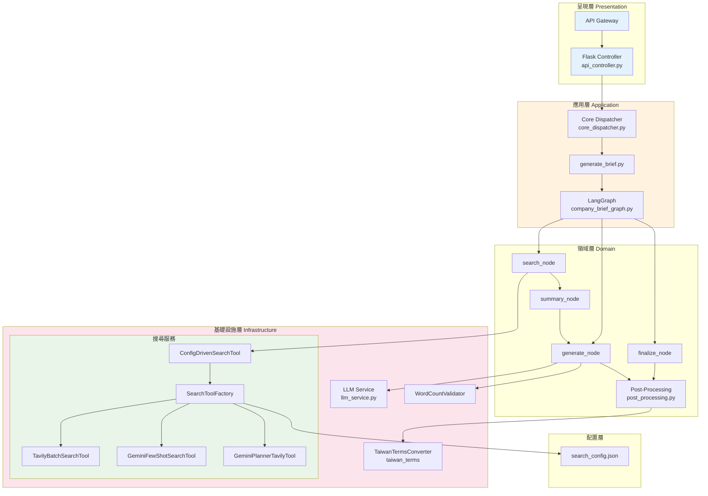
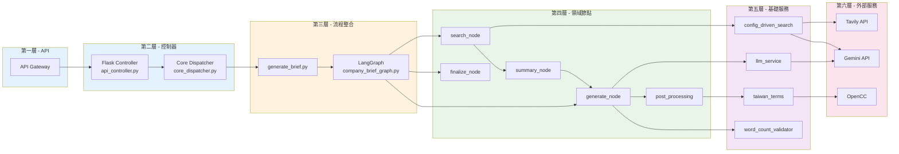
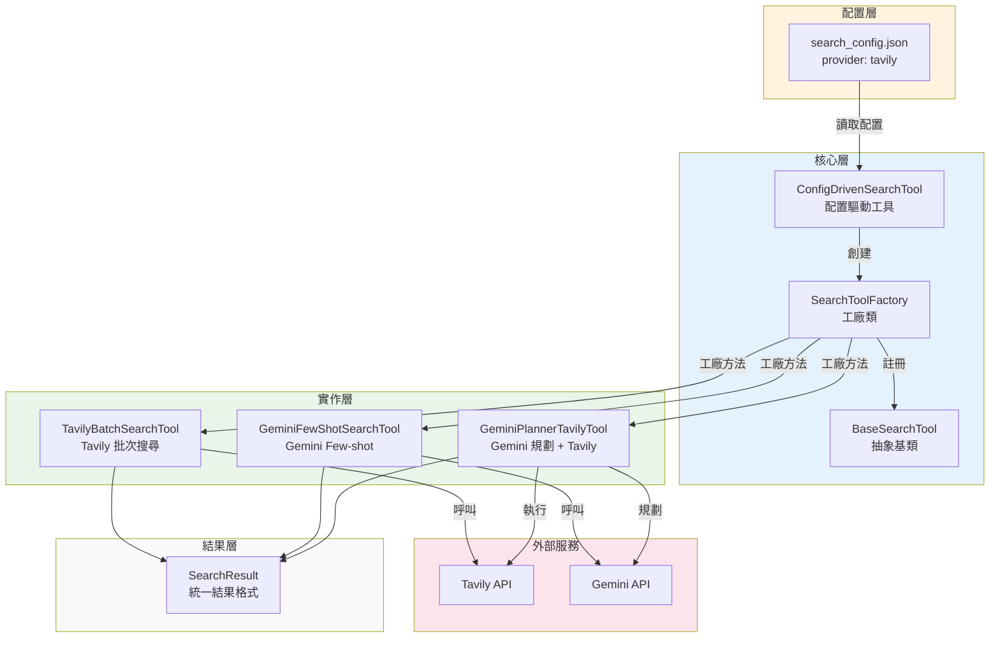

# 公司簡介生成與優化 API

**當前版本**: v0.4.1 (Phase 26) - 2026-04-28

**最新更新**:
- ✅ Phase 26: 前端 Layout 調整（左右分欄 + 結果摺疊 + 錯誤三態顯示）
- ✅ Phase 25: 數字格式清理與簡化 + 錯誤處理補強 + DB schema 優化
- ✅ Phase 24: optimization_mode 參數傳遞修復 + DB schema 更新
- ✅ Phase 23: 模板多樣化（Prompt + 三個庫）

**版本歷史**: v0.4.1 > v0.4.0 > v0.3.9 > v0.3.8 > v0.3.7 > v0.3.6 > v0.3.5 > ... > v0.3.0 > v0.2.0 > v0.1.0

---

## 功能特色

### 作業模式

| 模式 | 說明 |
|------|------|
| **GENERATE** | 根據輸入的公司名稱與統一編號，從網路搜取相關資訊，並由 LLM 生成專業的公司簡介 |

### 核心能力

- **自動化資料蒐集**：支援多種搜尋策略（Tavily、Gemini），可配置切換
- **四面向結構化搜尋**：搜尋結果直接以 foundation/core/vibe/future 四面向 JSON 回傳
- **錯誤處理標準化**：32 個錯誤代碼 + ErrorResponse schema + 統一錯誤回應格式
- **降級機制**：搜尋失敗時使用 user_input 生成簡介
- **LLM 整合**：採用 Google Gemini 生成高品質內容
- **三模板差異化**：支援 CONCISE / STANDARD / DETAILED 三種輸出模式
- **風險控制**：內建敏感詞過濾與內容安全檢核
- **Token 成本管理**：記錄並追蹤 API 呼叫費用
- **台灣用語轉換**：自動將中國用語轉換為台灣用語（300+ 詞彙）

---

## 技術架構

### 技術堆疊

| 類別 | 技術 |
|------|------|
| Web Framework | Flask + Vite (前端) |
| LLM | Google Gemini (generativeai) |
| **前端框架** | **Vue 3 + Vite + Tailwind CSS v4** |
| **搜尋策略** | **Tavily / Gemini（可配置切換）** |
| 流程控制 | LangGraph |
| Data Validation | Pydantic |
| 繁體中文處理 | OpenCC |
| Deployment | Serverless Framework (AWS Lambda + API Gateway) |
| Testing | Pytest |

### 服務流程

公司簡介生成服務採用 **LangGraph 狀態圖** 控制流程，包含以下節點：

```
搜尋 (search_node) → 摘要整理 (summary_node) → 生成 (generate_node) → 後處理 (post_processing)
```

**流程說明**：
1. **搜尋節點**：根據公司名稱從網路取得相關資訊，直接返回四面向結構化 JSON（foundation/core/vibe/future）
2. **摘要整理節點**：將結構化搜尋結果合併為四面向摘要
3. **生成節點**：結合用戶輸入與四面向摘要生成簡介
4. **後處理**：台灣用語轉換、風格優化

**四面向結構化格式**：
| 面向 | 說明 |
|------|------|
| `foundation` | 品牌實力與基本資料（成立時間、資本額、統一編號等） |
| `core` | 技術產品與服務核心（主營業務、技術亮點等） |
| `vibe` | 職場環境與企業文化（員工評價、企業文化等） |
| `future` | 近期動態與未來展望（新聞、發展方向等） |

### 系統架構圖



### 模組依賴關係圖（單一流程）



    style Layer1 fill:#e1f5fe
    style Layer2 fill:#e1f5fe
    style Layer3 fill:#fff3e0
    style Layer4 fill:#e8f5e8
    style Layer5 fill:#f3e5f5
    style Layer6 fill:#fce4ec
```

### 搜尋工具層模組圖



---

## 目錄結構

```
OrganBriefOptimization/
├── frontend/                   # Vue 3 前端
│   ├── src/
│   │   ├── App.vue             # 主頁面 (左右分欄 + 結果歷史)
│   │   ├── components/
│   │   │   ├── BriefForm.vue   # 表單元件
│   │   │   └── ResultPanel.vue # 結果面板 (Accordion 摺疊)
│   │   ├── api.js              # API 呼叫
│   │   ├── main.js             # 前端入口
│   │   └── style.css           # Tailwind CSS 入口
│   ├── package.json
│   └── vite.config.js
├── config/
│   └── search_config.json       # 搜尋策略配置（可切換 provider）
├── run_api.py                  # 本地開發入口腳本
├── serverless.yml              # Serverless 部署配置
├── requirements.txt            # Python 依賴
├── src/
│   ├── functions/              # API 核心邏輯
│   │   ├── api_controller.py   # Flask 路由控制器
│   │   └── utils/              # 工具函式
│   │       ├── generate_brief.py
│   │       ├── prompt_builder.py  # Prompt 建構（含三模板差異化）
│   │       ├── post_processing.py # 後處理（含台灣用語轉換）
│   │       └── word_count_validator.py # 字數檢核
│   ├── services/               # 商業邏輯服務
│   │   ├── llm_service.py
│   │   ├── tavily_search.py
│   │   ├── search_tools.py      # 搜尋工具層（工廠 + 工具類）⭐
│   │   └── config_driven_search.py # 配置驅動搜尋 ⭐
│   ├── langgraph_state/        # LangGraph 流程控制
│   │   ├── company_brief_graph.py  # 狀態圖定義
│   │   └── state.py            # 狀態定義
│   ├── schemas/                # Pydantic 資料模型
│   ├── plugins/                # 外掛模組
│   │   └── taiwan_terms/       # 台灣用語轉換外掛
│   └── config.py               # 組態配置
├── scripts/                    # 輔助腳本
│   └── stage3_test/           # 測試區
│       ├── search_tools.py    # 搜尋工具測試區
│       └── test_search_tools.py
└── tests/                     # 測試檔案
```

---

## 搜尋工具層

本系統支援透過配置文件切換不同的搜尋策略，實現配置驅動的搜尋體系。

### 支援的策略

| 策略 | 工具類別 | API 呼叫 | 特性 |
|------|----------|---------|------|
| `tavily` | TavilyBatchSearchTool | 1次 | 快速、自然語言 |
| `gemini_fewshot` | GeminiFewShotSearchTool | 1次 | 完整、JSON 格式 |
| `gemini_planner_tavily` | GeminiPlannerTavilyTool | 8次 | 彈性、<s tructured |

### 切換方式

修改 `config/search_config.json` 中的 `provider` 欄位：

```json
{
    "search": {
        "provider": "tavily"
    }
}
```

### 使用範例

```python
# 方式一：最簡單（推薦）- 自動根據配置執行
from src.services.config_driven_search import search
result = search("澳霸有限公司")

# 方式二：建立工具實例
from src.services.config_driven_search import ConfigDrivenSearchTool
tool = ConfigDrivenSearchTool()
result = tool.search("澳霸有限公司")

# 方式三：動態切換
tool = ConfigDrivenSearchTool()
tool.switch_provider("tavily")
result = tool.search("澳霸有限公司")
```

---

## 台灣用語轉換功能

本系統內建台灣用語轉換外掛模組，可自動將生成內容中的中國用語轉換為台灣用語。

### 特性

- **涵蓋 300+ 商業常用詞彙**：精選自 Taiwan.md 專案的關鍵詞彙
- **智能轉換**：同時處理簡體轉繁體與用語轉換
- **高效能**：處理時間 < 1ms，對整體系統影響極小
- **支援 HTML 與純文本**：可正確處理 HTML 標籤內的文字內容

### 使用範例

```python
from src.plugins.taiwan_terms import TaiwanTermsConverter

# 建立轉換器實例
converter = TaiwanTermsConverter()

# 轉換文本
result = converter.convert("今天天氣很好，我們使用U盤來存儲數據。")
print(result.text)
# 輸出："今天天氣很好，我們使用隨身碟來存儲資料。"
```

---

## 三模板差異化

本系統支援三種不同的輸出模式，透過 `optimization_mode` 參數控制：

| 模板 | 字數範圍 | 說明 |
|------|---------|------|
| `CONCISE` | 40-120 字 | 精簡模式，1-2 句話 |
| `STANDARD` | 130-230 字 | 標準模式，3-5 句話 |
| `DETAILED` | 280-550 字 | 詳細模式，5-10 句話 |

### API 使用方式

```json
{
  "organNo": "69188618",
  "organ": "私立揚才文理短期補習班",
  "mode": "GENERATE",
  "optimization_mode": "STANDARD"
}
```

---

## 本地開發

### 環境建置

```bash
# 建立虛擬環境
python -m venv .venv
source .venv/bin/activate  # Linux/Mac

# 安裝依賴
pip install -r requirements.txt
```

### 執行指令

```bash
# 啟動 Flask 伺服器
python run_api.py
```

伺服器預設運行於 `http://localhost:5000`

---

## API 使用方式

### 端點

```
POST /v1/company/profile/process
```

### 請求格式

```json
{
  "organNo": "69188618",
  "organ": "私立揚才文理短期補習班",
  "mode": "GENERATE",
  "optimization_mode": "STANDARD"
}
```

### curl 範例

```bash
curl -X POST http://localhost:5000/v1/company/profile/process \
  -H "Content-Type: application/json" \
  -d '{
    "organNo": "69188618",
    "organ": "私立揚才文理短期補習班",
    "mode": "GENERATE"
  }'
```

### 回應格式

```json
{
  "success": true,
  "data": {
    "title": "公司簡介標題",
    "summary": "簡介摘要",
    "body_html": "<p>HTML 格式的詳細內容</p>"
  }
}
```

---

## 環境變數

請參考 `.env.example` 檔案建立 `.env`，必要變數如下：

```
GEMINI_API_KEY=your_gemini_api_key
TAVILY_API_KEY=your_tavily_api_key
SERPER_API_KEY=your_serper_api_key
TAIWAN_TERMS_ENABLED=true  # 啟用台灣用語轉換
```

---

## 版本變動

| 版本 | 日期 | 摘要 | 詳細 |
|------|------|------|------|
| **v0.4.1** | **2026-04-28** | **Phase 26: 前端 Layout 調整（左右分欄 + 結果摺疊 + 錯誤三態 + trace_id）** | - |
| v0.4.0 | 2026-04-27 | Phase 25: 數字格式清理 + 錯誤處理補強 + DB schema 優化 | - |
| v0.3.9 | 2026-04-27 | Phase 24: optimization_mode 修復 + DB schema 更新 | - |
| v0.3.8 | 2026-04-23 | Phase 23: 模板多樣化 | - |
| v0.3.7 | 2026-04-18 | Phase 22: Markdown 清理 | - |
| v0.3.6 | 2026-04-16 | Phase 21: 錯誤處理標準化 | - |
| v0.3.5 | 2026-04-14 | Phase 20: 配置驅動重構 | - |
| v0.3.1 | 2026-04-11 | Phase 17/19: 搜尋工具優化 | - |
| v0.3.0 | 2026-04-09 | Phase 15/16: 模型配置統一 | - |
| v0.2.0 | 2026-03-30 | Phase 14: 功能修復 | - |
| v0.1.0 | 2026-03-24 | Phase 12/13: 基礎版本 | [📄](docs/changelog/v0.1.0.md) |

