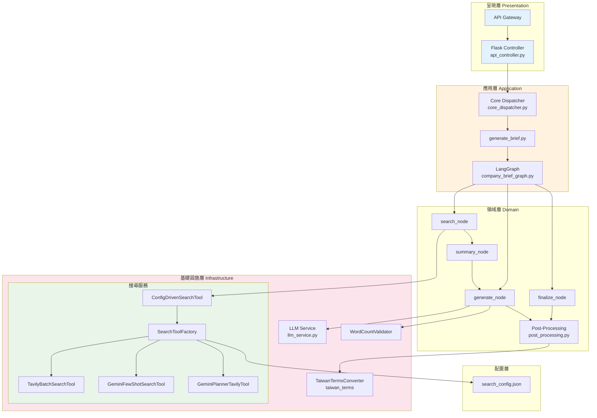
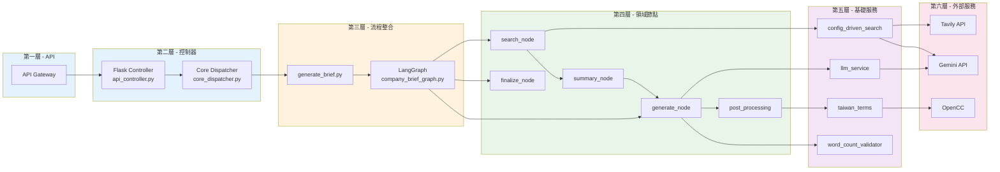
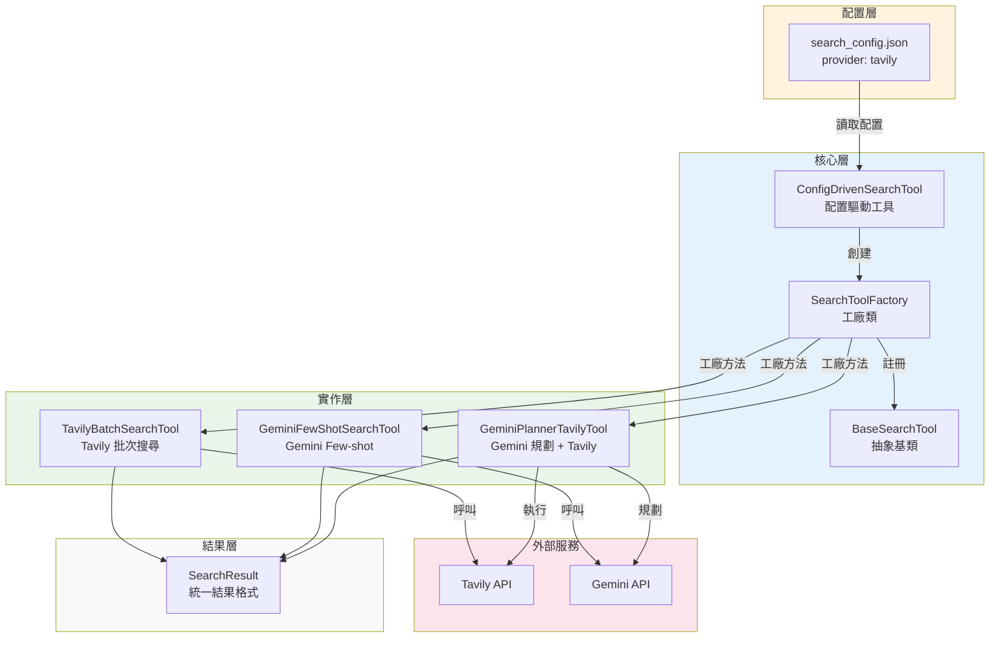

# 公司簡介生成與優化 API

**當前版本**: v0.3.8 (Phase 23) - 2026-04-23

這是一個採用 Serverless 架構的公司簡介生成與優化服務，部署於 AWS Lambda + API Gateway，提供 RESTful API 介面，支援從無到有生成公司簡介，以及優化現有的公司簡介內容。

**最新更新**:
- ✅ Phase 23: 模板多樣化（Prompt + 三個庫）
- ✅ Phase 22: Markdown 清理
- ✅ Phase 21: 錯誤處理標準化

**版本歷史**: v0.3.8 > v0.3.7 > v0.3.6 > v0.3.5 > ... > v0.3.0 > v0.2.0 > v0.1.0

---

## 功能特色

### 作業模式

| 模式 | 說明 |
|------|------|
| **GENERATE** | 根據輸入的公司名稱與統一編號，從網路搜取相關資訊，並由 LLM 生成專業的公司簡介 |

### 核心能力

- **自動化資料蒐集**：支援多種搜尋策略（Tavily、Gemini），可配置切換
- **四面向結構化搜尋**：搜尋結果直接以 foundation/core/vibe/future 四面向 JSON 回傳
- **錯誤處理標準化**：32 個錯誤代碼 + ErrorResponse schema + 統一錯誤回應格式
- **降級機制**：搜尋失敗時使用 user_input 生成簡介
- **LLM 整合**：採用 Google Gemini 生成高品質內容
- **三模板差異化**：支援 CONCISE / STANDARD / DETAILED 三種輸出模式
- **風險控制**：內建敏感詞過濾與內容安全檢核
- **Token 成本管理**：記錄並追蹤 API 呼叫費用
- **台灣用語轉換**：自動將中國用語轉換為台灣用語（300+ 詞彙）

---

## 技術架構

### 技術堆疊

| 類別 | 技術 |
|------|------|
| Web Framework | Flask |
| LLM | Google Gemini (generativeai) |
| **搜尋策略** | **Tavily / Gemini（可配置切換）** |
| 流程控制 | LangGraph |
| Data Validation | Pydantic |
| 繁體中文處理 | OpenCC |
| Deployment | Serverless Framework (AWS Lambda + API Gateway) |
| Testing | Pytest |

### 服務流程

公司簡介生成服務採用 **LangGraph 狀態圖** 控制流程，包含以下節點：

```
搜尋 (search_node) → 摘要整理 (summary_node) → 生成 (generate_node) → 後處理 (post_processing)
```

**流程說明**：
1. **搜尋節點**：根據公司名稱從網路取得相關資訊，直接返回四面向結構化 JSON（foundation/core/vibe/future）
2. **摘要整理節點**：將結構化搜尋結果合併為四面向摘要
3. **生成節點**：結合用戶輸入與四面向摘要生成簡介
4. **後處理**：台灣用語轉換、風格優化

**四面向結構化格式**：
| 面向 | 說明 |
|------|------|
| `foundation` | 品牌實力與基本資料（成立時間、資本額、統一編號等） |
| `core` | 技術產品與服務核心（主營業務、技術亮點等） |
| `vibe` | 職場環境與企業文化（員工評價、企業文化等） |
| `future` | 近期動態與未來展望（新聞、發展方向等） |

### 系統架構圖



### 模組依賴關係圖（單一流程）



    style Layer1 fill:#e1f5fe
    style Layer2 fill:#e1f5fe
    style Layer3 fill:#fff3e0
    style Layer4 fill:#e8f5e8
    style Layer5 fill:#f3e5f5
    style Layer6 fill:#fce4ec
```

### 搜尋工具層模組圖



---

## 目錄結構

```
OrganBriefOptimization/
├── config/
│   └── search_config.json       # 搜尋策略配置（可切換 provider）
├── run_api.py                  # 本地開發入口腳本
├── serverless.yml              # Serverless 部署配置
├── requirements.txt            # Python 依賴
├── src/
│   ├── functions/              # API 核心邏輯
│   │   ├── api_controller.py   # Flask 路由控制器
│   │   └── utils/              # 工具函式
│   │       ├── generate_brief.py
│   │       ├── prompt_builder.py  # Prompt 建構（含三模板差異化）
│   │       ├── post_processing.py # 後處理（含台灣用語轉換）
│   │       └── word_count_validator.py # 字數檢核
│   ├── services/               # 商業邏輯服務
│   │   ├── llm_service.py
│   │   ├── tavily_search.py
│   │   ├── search_tools.py      # 搜尋工具層（工廠 + 工具類）⭐
│   │   └── config_driven_search.py # 配置驅動搜尋 ⭐
│   ├── langgraph_state/        # LangGraph 流程控制
│   │   ├── company_brief_graph.py  # 狀態圖定義
│   │   └── state.py            # 狀態定義
│   ├── schemas/                # Pydantic 資料模型
│   ├── plugins/                # 外掛模組
│   │   └── taiwan_terms/       # 台灣用語轉換外掛
│   └── config.py               # 組態配置
├── scripts/                    # 輔助腳本
│   └── stage3_test/           # 測試區
│       ├── search_tools.py    # 搜尋工具測試區
│       └── test_search_tools.py
└── tests/                     # 測試檔案
```

---

## 搜尋工具層

本系統支援透過配置文件切換不同的搜尋策略，實現配置驅動的搜尋體系。

### 支援的策略

| 策略 | 工具類別 | API 呼叫 | 特性 |
|------|----------|---------|------|
| `tavily` | TavilyBatchSearchTool | 1次 | 快速、自然語言 |
| `gemini_fewshot` | GeminiFewShotSearchTool | 1次 | 完整、JSON 格式 |
| `gemini_planner_tavily` | GeminiPlannerTavilyTool | 8次 | 彈性、<s tructured |

### 切換方式

修改 `config/search_config.json` 中的 `provider` 欄位：

```json
{
    "search": {
        "provider": "tavily"
    }
}
```

### 使用範例

```python
# 方式一：最簡單（推薦）- 自動根據配置執行
from src.services.config_driven_search import search
result = search("澳霸有限公司")

# 方式二：建立工具實例
from src.services.config_driven_search import ConfigDrivenSearchTool
tool = ConfigDrivenSearchTool()
result = tool.search("澳霸有限公司")

# 方式三：動態切換
tool = ConfigDrivenSearchTool()
tool.switch_provider("tavily")
result = tool.search("澳霸有限公司")
```

---

## 台灣用語轉換功能

本系統內建台灣用語轉換外掛模組，可自動將生成內容中的中國用語轉換為台灣用語。

### 特性

- **涵蓋 300+ 商業常用詞彙**：精選自 Taiwan.md 專案的關鍵詞彙
- **智能轉換**：同時處理簡體轉繁體與用語轉換
- **高效能**：處理時間 < 1ms，對整體系統影響極小
- **支援 HTML 與純文本**：可正確處理 HTML 標籤內的文字內容

### 使用範例

```python
from src.plugins.taiwan_terms import TaiwanTermsConverter

# 建立轉換器實例
converter = TaiwanTermsConverter()

# 轉換文本
result = converter.convert("今天天氣很好，我們使用U盤來存儲數據。")
print(result.text)
# 輸出："今天天氣很好，我們使用隨身碟來存儲資料。"
```

---

## 三模板差異化

本系統支援三種不同的輸出模式，透過 `optimization_mode` 參數控制：

| 模板 | 字數範圍 | 說明 |
|------|---------|------|
| `CONCISE` | 40-120 字 | 精簡模式，1-2 句話 |
| `STANDARD` | 130-230 字 | 標準模式，3-5 句話 |
| `DETAILED` | 280-550 字 | 詳細模式，5-10 句話 |

### API 使用方式

```json
{
  "organNo": "69188618",
  "organ": "私立揚才文理短期補習班",
  "mode": "GENERATE",
  "optimization_mode": "STANDARD"
}
```

---

## 本地開發

### 環境建置

```bash
# 建立虛擬環境
python -m venv .venv
source .venv/bin/activate  # Linux/Mac

# 安裝依賴
pip install -r requirements.txt
```

### 執行指令

```bash
# 啟動 Flask 伺服器
python run_api.py
```

伺服器預設運行於 `http://localhost:5000`

---

## API 使用方式

### 端點

```
POST /v1/company/profile/process
```

### 請求格式

```json
{
  "organNo": "69188618",
  "organ": "私立揚才文理短期補習班",
  "mode": "GENERATE",
  "optimization_mode": "STANDARD"
}
```

### curl 範例

```bash
curl -X POST http://localhost:5000/v1/company/profile/process \
  -H "Content-Type: application/json" \
  -d '{
    "organNo": "69188618",
    "organ": "私立揚才文理短期補習班",
    "mode": "GENERATE"
  }'
```

### 回應格式

```json
{
  "success": true,
  "data": {
    "title": "公司簡介標題",
    "summary": "簡介摘要",
    "body_html": "<p>HTML 格式的詳細內容</p>"
  }
}
```

---

## 環境變數

請參考 `.env.example` 檔案建立 `.env`，必要變數如下：

```
GEMINI_API_KEY=your_gemini_api_key
TAVILY_API_KEY=your_tavily_api_key
SERPER_API_KEY=your_serper_api_key
TAIWAN_TERMS_ENABLED=true  # 啟用台灣用語轉換
```

---

## 版本變動

### v0.3.8 - Phase 23 模板多樣化

**日期**: 2026-04-23

#### Phase 23a: Prompt 更新 ✅

| 工項 | 說明 |
|------|------|
| **generate Prompt** | 加入撰寫原則 5-7：開頭多樣化、段落結構多樣化、句型變化 |
| **optimize Prompt** | 加入優化指令 5-6：開頭多樣化、段落結構多樣化 |
| **源頭治理** | 讓 LLM 本身知道要輸出多樣化內容，而非依賴後處理硬改 |

#### Phase 23b: 模板庫實作 ✅

| 工項 | 說明 |
|------|------|
| **文章框架庫** | 6 種段落順序（traditional, service_first, value_first, future_oriented, feature_first, data_oriented）|
| **情境庫** | 5 種開頭方式（產業、市場、問題、趨勢、使用者）|
| **句型庫** | 7 種句型（服務、特色、數據、問句、情境、成就、承諾）|
| **輔助函式** | `get_random_structure()`, `get_random_opening()`, `get_random_sentence_pattern()`, `render_opening()`, `render_sentence()`|

**解決的問題**：v0.2.0 測試報告中發現的「模板過於一致」（#2）與「句型僵化」（#3）。

#### 新增檔案

| 檔案 | 說明 |
|------|------|
| `src/functions/utils/structure_library.py` | Phase 23b 三個庫（文章框架庫 6 + 情境庫 5 + 句型庫 7）|
| `tests/test_structure_library.py` | Phase 23b 單元測試（34 項）|
| `scripts/test_phase23_prompt.py` | Phase 23a Prompt 驗證腳本 |
| `scripts/test_structure_diversification.py` | Phase 23b 整合測試腳本 |

#### 修改檔案

| 檔案 | 變更 |
|------|------|
| `src/functions/generate_prompt_template.txt` | 加入撰寫原則 5-7 |
| `src/functions/optimize_prompt_template.txt` | 加入優化指令 5-6 |
| `src/functions/utils/post_processing.py` | 匯入 structure_library，記錄選用框架/句型日誌 |

---

### v0.3.7 - Phase 22 Markdown 清理

**日期**: 2026-04-23

#### Phase 22: Markdown 格式汙染清理 ✅

| 工項 | 說明 |
|------|------|
| **Markdown 清理模組** | 新增 `src/functions/utils/markdown_cleaner.py`，提供 `clean_markdown()` 與 `clean_markdown_aggressive()` |
| **移除格式汙染** | 自動移除 LLM 輸出中的 `**bold**`、`## header`、`### header` 等 Markdown 語法 |
| **電話保護** | 使用佔位符策略，保留 `***-****-****` 格式不被誤清 |
| **整合點** | 在 `post_processing.py` 的 body_html 與 summary 流程中插入清理 |

**解決的問題**：v0.2.0 測試報告中發現的「格式汙染」— LLM 輸出殘留 `**公司名稱**`、`## 公司簡介` 等 Markdown 語法。

#### 新增檔案

| 檔案 | 說明 |
|------|------|
| `src/functions/utils/markdown_cleaner.py` | Markdown 清理模組（clean_markdown + clean_markdown_aggressive）|

#### 修改檔案

| 檔案 | 變更 |
|------|------|
| `src/functions/utils/post_processing.py` | 在 body_html 與 summary 處理流程插入 `clean_markdown()` |

---

### v0.3.6 - Phase 21 錯誤處理標準化

**日期**: 2026-04-23

#### Phase 21: 錯誤處理標準化 ✅

| 工項 | 說明 |
|------|------|
| **ErrorCode 枚舉** | 統一管理 32 個錯誤代碼（SVC_xxx, LLM_xxx, API_xxx, SCH_xxx） |
| **ErrorResponse schema** | API 錯誤回應格式 `{success, error: {code, message, timestamp, trace_id, recoverable}}` |
| **錯誤代碼使用枚舉** | `company_brief_graph.py`, `llm_service.py` 使用 `ErrorCode.SVC_004.code` |
| **錯誤訊息清理** | 自動提取 API 錯誤的 code, status, message，簡化顯示 |
| **降級機制** | 當 `aspect_summaries` 為空時，使用 `user_input` 生成 |
| **user_input dict** | 統一為 dict 格式（capital, employees, founded_year, inputText） |

**錯誤回應格式**：

```json
{
    "success": false,
    "error": {
        "code": "SVC_004",
        "message": "無法生成公司簡介：搜尋服務暫時無法使用",
        "timestamp": "2026-04-23T06:22:26.554041",
        "trace_id": "trace-...",
        "recoverable": true
    }
}
```

**錯誤訊息格式（修正後）**：

```
# 之前（太長）
429 RESOURCE_EXHAUSTED. {'error': {'code': 429, 'message': 'Rate limit exceeded', 'status': 'RESOURCE_EXHAUSTED'}}

# 之後（簡潔）
(429) RESOURCE_EXHAUSTED Rate limit exceeded
```

#### Phase 21 完成項目

| 項目 | 狀態 |
|------|------|
| ErrorCode 枚舉完整性 | ✅ 32 個正確 |
| ErrorResponse schema | ✅ 回傳格式正確 |
| ErrorCode 使用枚舉 | ✅ 兩處修正 |
| 錯誤訊息清理 | ✅ 自動提取 |
| 搜尋超時測試 | ✅ SVC_002 映射正確 |
| SVC_001/003/004 測試 | ✅ SVC_004 已實作 |
| LLM 429 | ⚠️ API 配額充足，未能觸發實際測試 |

#### 新增檔案

| 檔案 | 說明 |
|------|------|
| `config/field_mapping.json` | 字段到面向的映射配置 |
| `config/field_mapping_schema.json` | 配置 schema 定義 |
| `src/services/config_loader.py` | 配置載入模組 |

---

### v0.3.5 - Phase 20 配置驅動重構

**日期**: 2026-04-22

#### Phase 20: 配置驅動搜尋重構 ✅

| 工項 | 說明 |
|------|------|
| **ConfigDrivenSearchTool** | 配置驅動的搜尋工具，根據 config 自動選擇 provider |
| **field_mapping.json** | 字段到面向的映射配置 |
| **config_loader.py** | 配置載入模組 |

---

### v0.3.1 - Phase 17/19 搜尋工具優化

**日期**: 2026-04-18

#### Phase 17/19: 搜尋工具優化 ✅

| 工項 | 說明 |
|------|------|
| **ParallelMultiSourceTool** | 平行多來源搜尋工具 |
| **ParallelFieldSearch** | 平行字段搜尋（7個字段獨立查詢） |
| **Gemini Fewshot 優化** | 新增穩定的 Fewshot 方案 |

---

### v0.3.0 - Phase 15/16 模型配置統一與搜尋格式化

**日期**: 2026-04-16

#### Phase 15: 模型配置統一管理 ✅

| 工項 | 說明 |
|------|------|
| `SearchConfig` + `ModelConfig` dataclass | 統一的配置結構 |
| `_create_tool()` 模型傳遞 | 各 provider 的模型從 config 讀取 |
| `GeminiPlannerTavilyTool` 參數化 | 移除硬編碼模型名稱 |
| `config/search_config.json` 新 schema | `models` 區塊集中管理 |

#### Phase 16: 搜尋時格式化優化 ✅

| 工項 | 說明 |
|------|------|
| 設計 `design_spec.md` | 四面向 JSON schema 定義 |
| `GeminiFewShotSearchTool` Prompt 更新 | 返回四面向結構化 JSON |
| `GeminiPlannerTavilyTool` Prompt 更新 | 四面向規劃查詢 |
| `summary_node` 合併邏輯更新 | 支援結構化資料合併 + Fallback |

**整合測試發現並修復的 Bug**：

| Bug | 問題 | 修復 |
|-----|------|------|
| `search_node` 轉換格式錯誤 | `results=[{"data": ...}]` 導致 `is_structured_format` 永遠回傳 `False` | 改為 `results=[{"aspect": ..., "content": ...}]` |

---

### v0.2.0 - Phase 14 功能修復

**日期**: 2026-04-13

#### 新增功能

| 功能 | 說明 |
|------|------|
| **搜尋工具層** | 配置驅動的搜尋策略切換體系 |
| **三模板差異化** | CONCISE / STANDARD / DETAILED 三種模式 |
| **字數限制優化** | Prompt 層控制 + 字數檢核 + LLM 重寫 |
| **台灣用語轉換** | 自動將中國用語轉換為台灣用語（300+ 詞彙） |

#### 架構變更

| 變更項目 | 說明 |
|----------|------|
| 新增 `search_tools.py` | 搜尋工具層核心（工廠 + 工具類） |
| 新增 `config_driven_search.py` | 配置驅動搜尋工具 |
| 新增 `config/search_config.json` | 搜尋策略配置文件 |
| 新增 `word_count_validator.py` | 字數檢核模組 |
| 新增 `summarizer.py` | 四面向彙整器 |
| 新增 `summary_node` | 摘要整理節點 |

#### 效能提升

| 版本 | 平均時間 | 提升 |
|------|---------|------|
| Baseline | 6.54s/case | - |
| Phase 14整合後 | 5.52s/case | ~1.02s/case |

---

### v0.1.0 - Phase 12/13 基礎版本

**日期**: 2026-04-08

#### 基礎功能

| 功能 | 說明 |
|------|------|
| API 基礎架構 | Flask + Serverless |
| LLM 整合 | Google Gemini |
| 搜尋服務 | Serper API |
| 風險控制 | 敏感詞過濾 |
| LangGraph | 狀態管理系統 |

#### 存在的問題

| 問題 | 說明 |
|------|------|
| 字數限制不精確 | 內容超出限制 |
| 模板無差異化 | 三種模式輸出相同 |
| 冗言過多 | LLM 生成多餘的開頭語 |
| 中國用語 | 未轉換為台灣用語 |

### v0.3.0 - Phase 15/16 模型配置統一與搜尋格式化

**日期**: 2026-04-16

#### Phase 15: 模型配置統一管理 ✅

| 工項 | 說明 |
|------|------|
| `SearchConfig` + `ModelConfig` dataclass | 統一的配置結構 |
| `_create_tool()` 模型傳遞 | 各 provider 的模型從 config 讀取 |
| `GeminiPlannerTavilyTool` 參數化 | 移除硬編碼模型名稱 |
| `config/search_config.json` 新 schema | `models` 區塊集中管理 |

#### Phase 16: 搜尋時格式化優化 ✅

| 工項 | 說明 |
|------|------|
| 設計 `design_spec.md` | 四面向 JSON schema 定義 |
| `GeminiFewShotSearchTool` Prompt 更新 | 返回四面向結構化 JSON |
| `GeminiPlannerTavilyTool` Prompt 更新 | 四面向規劃查詢 |
| `summary_node` 合併邏輯更新 | 支援結構化資料合併 + Fallback |

**整合測試發現並修復的 Bug**：

| Bug | 問題 | 修復 |
|-----|------|------|
| `search_node` 轉換格式錯誤 | `results=[{"data": ...}]` 導致 `is_structured_format` 永遠回傳 `False` | 改為 `results=[{"aspect": ..., "content": ...}]` |

---

### v0.0.2 - Phase 14 功能修復

**日期**: 2026-04-13

#### 新增功能

| 功能 | 說明 |
|------|------|
| **搜尋工具層** | 配置驅動的搜尋策略切換體系 |
| **三模板差異化** | CONCISE / STANDARD / DETAILED 三種模式 |
| **字數限制優化** | Prompt 層控制 + 字數檢核 + LLM 重寫 |
| **台灣用語轉換** | 自動將中國用語轉換為台灣用語（300+ 詞彙） |

#### 架構��更

| 變更項目 | 說明 |
|----------|------|
| 新增 `search_tools.py` | 搜尋工具層核心（工廠 + 工具類） |
| 新增 `config_driven_search.py` | 配置驅動搜尋工具 |
| 新增 `config/search_config.json` | 搜尋策略配置文件 |
| 新增 `word_count_validator.py` | 字數檢核模組 |

#### Phase 14 完成項目

| 階段 | 狀態 | 完成度 |
|------|------|--------|
| 階段一: 緊急修復 | ✅ 完成 | 100% |
| Checkpoint 1 | ✅ 通過 | 100% |
| 階段二: 核心功能 | ✅ 完成 | 100% |
| Stage 3: 搜尋工具層 | ✅ 完成 | 100% |
| 四面向流程整合 (2026-04-15) | ✅ 完成 | 100% |

#### 效能提升

| 版本 | 平均時間 | 提升 |
|------|---------|------|
| Baseline (b73c9bf) | 6.54s/case | - |
| Phase 14整合後 | 5.52s/case | ~1.02s/case |

---

### v0.0.1 - Phase 12/13 基礎版本

**日期**: 2026-04-08

#### 基礎功能

| 功能 | 說明 |
|------|------|
| API 基礎架構 | Flask + Serverless |
| LLM 整合 | Google Gemini |
| 搜尋服務 | Serper API |
| 風險控制 | 敏感詞過濾 |
| LangGraph | 狀態管理系統 |

#### 存在的問題

| 問題 | 說明 |
|------|------|
| 字數限制不精確 | 內容超出限制 |
| 模板無差異化 | 三種模式輸出相同 |
| 冗言過多 | LLM 生成多餘的開頭語 |
| 中國用語 | 未轉換為台灣用語 |

**日期**: 2026-04-16

#### Phase 15: 模型配置統一管理 ✅

| 工項 | 說明 |
|------|------|
| `SearchConfig` + `ModelConfig` dataclass | 統一的配置結構 |
| `_create_tool()` 模型傳遞 | 各 provider 的模型從 config 讀取 |
| `GeminiPlannerTavilyTool` 參數化 | 移除硬編碼模型名稱 |
| `config/search_config.json` 新 schema | `models` 區塊集中管理 |

**成功標準**：
- ✅ `models.gemini_fewshot.model` 改變時實際模型跟著變
- ✅ `models.gemini_planner_tavily.model` 改變時實際模型跟著變
- ✅ `generate_content` 呼叫中無硬編碼模型名稱
- ✅ 所有模型配置只在 `config/search_config.json` 一處

#### Phase 16: 搜尋時格式化優化 ✅

| 工項 | 說明 |
|------|------|
| 設計 `design_spec.md` | 四面向 JSON schema 定義 |
| `GeminiFewShotSearchTool` Prompt 更新 | 返回四面向結構化 JSON |
| `GeminiPlannerTavilyTool` Prompt 更新 | 四面向規劃查詢 |
| `summary_node` 合併邏輯更新 | 支援結構化資料合併 + Fallback |

**流程改變**：
```
# Before (Phase 15)
搜尋 → 純文字結果 → 拼接 → 四面向

# After (Phase 16)
搜尋（Prompt 要求四面向 JSON）→ 結構化結果 → 直接合併 → 四面向
```

**整合測試發現並修復的 Bug**：

| Bug | 問題 | 修復 |
|-----|------|------|
| `search_node` 轉換格式錯誤 | `results=[{"data": ...}]` 導致 `is_structured_format` 永遠回傳 `False` | 改為 `results=[{"aspect": ..., "content": ...}]` |

#### Phase 15/16 測試結果

| 測試套件 | 結果 |
|----------|------|
| `tests/test_search_formatting.py` | ✅ 7/7 passed |
| `tests/test_services.py` | ✅ 9/9 passed |
| 端到端流程 | ✅ 全部通過 |

---

### v0.0.1 - Phase 12/13 基礎版本

**日期**: 2026-04-08

#### 基礎功能

| 功能 | 說明 |
|------|------|
| API 基礎架構 | Flask + Serverless |
| LLM 整合 | Google Gemini |
| 搜尋服務 | Serper API |
| 風險控制 | 敏感詞過濾 |
| LangGraph | 狀態管理系統 |

#### 存在的問題

| 問題 | 說明 |
|------|------|
| 字數限制不精確 | 內容超出限制 |
| 模板無差異化 | 三種模式輸出相同 |
| 冗言過多 | LLM 生成多餘的開頭語 |
| 中國用語 | 未轉換為台灣用語 |

---