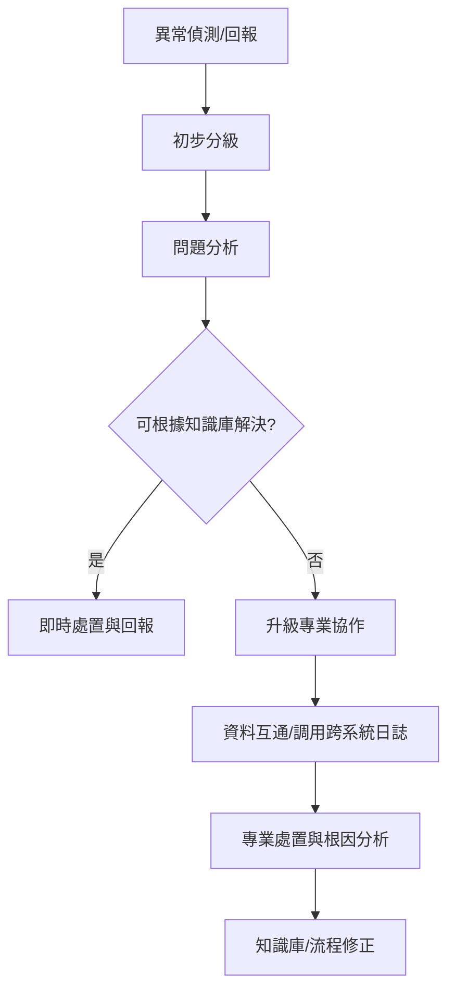

# Phase 8：E2E Process Improvement

## 異常診斷SOP

### 1. 介紹
本文件聚焦於E2E流程異常發生時的標準診斷及處置作業流程，協助團隊以系統化步驟迅速定位與解決問題。

### 2. 異常診斷SOP流程

#### 2.1 流程總覽

#### 2.2 詳細步驟說明

- **異常偵測/回報**：
  - 系統自動監控或人工主動回報。
  - 填寫異常通報表，記錄事件基本資訊。
- **初步分級**：
  - 即時評估異常嚴重度（高/中/低），依分級決定處置窗口。
- **問題分析**：
  - 根據異常類型調閱對應系統日誌。
  - 查詢知識庫，嘗試套用既有解法。
- **即時處置與回報**：
  - 知識庫可解決者，照標準流程修復並回填解決經驗。
- **升級專業協作**：
  - 異常複雜或無資料經驗時，啟動跨團隊處理（如架構師/DBA/DevOps介入）。
  - 必要時啟動E2E全流程檢查。
- **資料互通/調用跨系統日誌**：
  - 彙整相關子系統全鏈日誌，分析串接節點。
- **專業處置與根因分析**：
  - 釐清源頭與多因場景，持續追蹤修正建議。
- **知識庫/流程修正**：
  - 修正知識庫條目，優化後續自動化提示或監控指標。
  - 必要時修訂SOP流程與異常分級標準。

---

### 3. 附錄：異常診斷通用表格範例

| 項目         | 說明                         |
|--------------|------------------------------|
| 異常時間     | yyyy-mm-dd HH:MM             |
| 發生系統     | xxxx                         |
| 異常描述     | 簡要描述現象                 |
| 嚴重度分級   | 高/中/低                     |
| 初步原因分析 | 現場觀察/日誌trace           |
| 已採取措施   | 知識庫對應操作/已通報窗口   |
| 處置結果     | 已解決/需升級                |
| 回填人員     | xxxx                         |
| 補充說明     | 可選                          |
