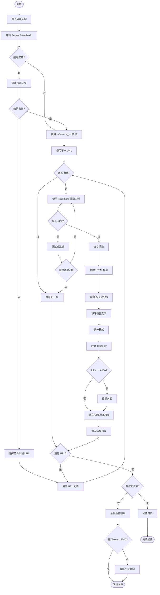
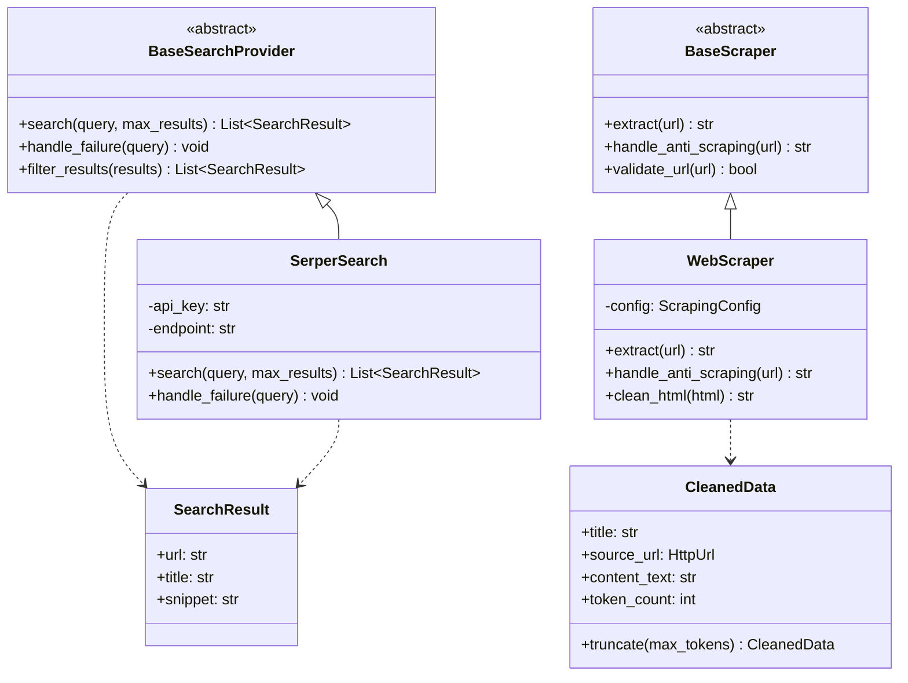
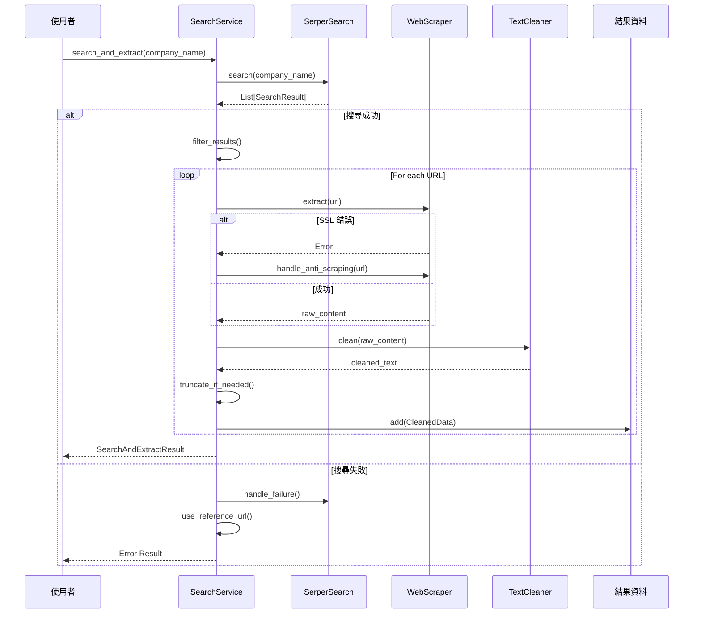
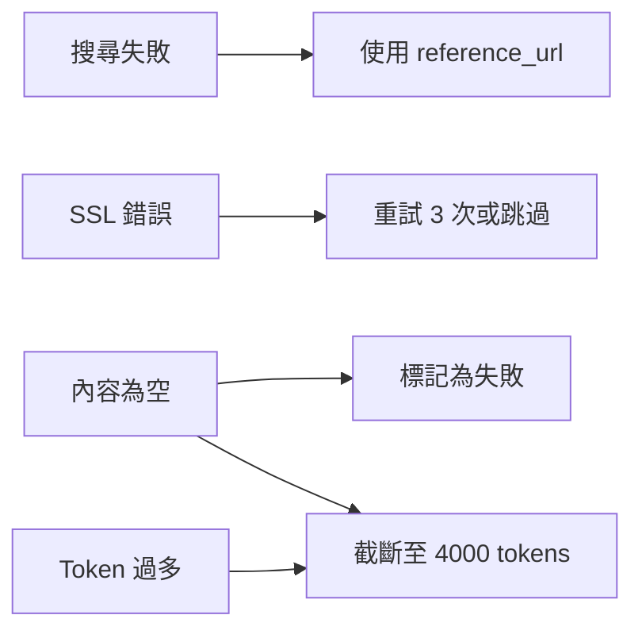

# Search and Extract Pipeline - 搜尋與提取流程圖

## 概述
本文檔描述 Phase 2 數據檢索與前處理模組的完整流程。

---

## 主流程圖 (Mermaid)



---

## 模組架構圖

```mermaid
graph TB
    subgraph "搜尋層 (Search Layer)"
        BS[BaseSearchProvider]
        SS[SerperSearch]
        MS[MockSearch]
        
        BS <|-- SS
        BS <|-- MS
    end
    
    subgraph "爬蟲層 (Scraper Layer)"
        BS2[BaseScraper]
        WS[WebScraper]
        PS[PlaywrightScraper]
        
        BS2 <|-- WS
        BS2 <|-- PS
    end
    
    subgraph "清洗層 (Cleaning Layer)"
        TC[TextCleaner]
        HTML[HTML Cleaner]
        NOISE[Noise Cleaner]
        FORMAT[Formatter]
    end
    
    subgraph "資料層 (Data Layer)"
        CD[CleanedData]
        SR[SearchAndExtractResult]
    end
    
    Search[SearchService] --> BS
    Search --> WS
    Search --> TC
    Search --> CD
    
    WS --> TC
    TC --> HTML
    TC --> NOISE
    TC --> FORMAT
    TC --> CD
    CD --> SR
```

---

## 類別關係圖



---

## 序列圖



---

## 錯誤處理流程



---

**文件版本**: 1.0  
**最後更新**: 2026-03-27  
**作者**: @ARCH
