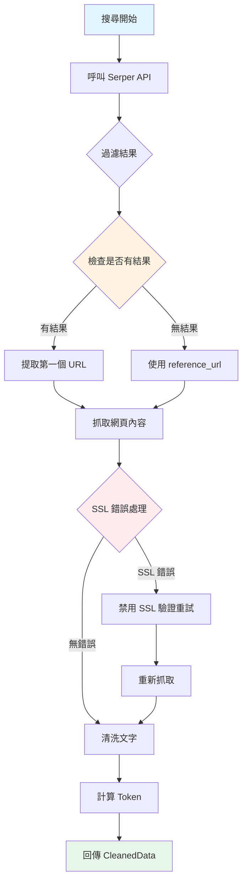
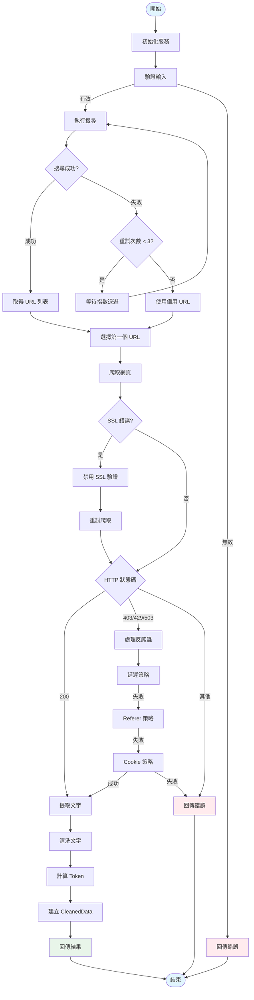
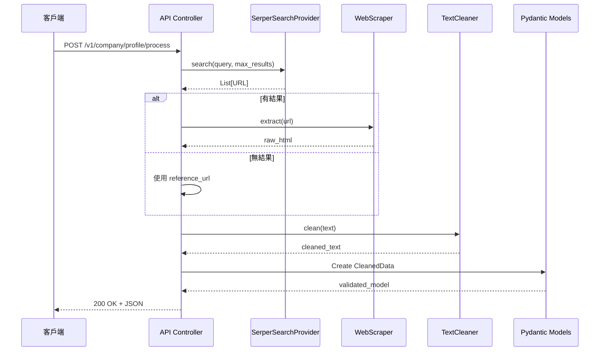
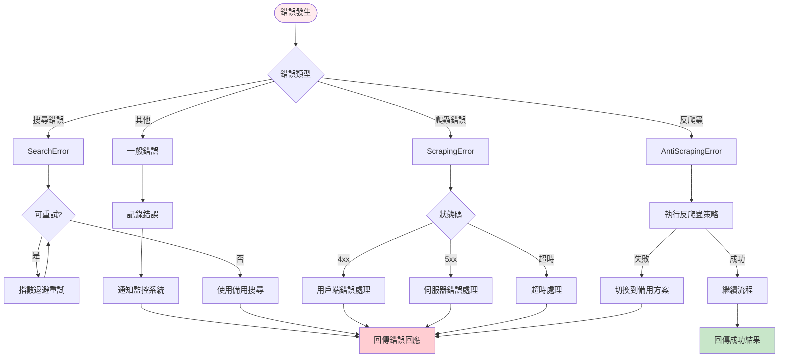
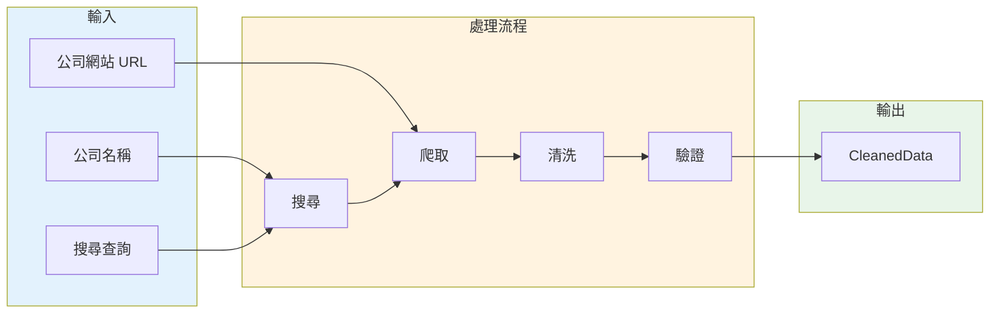
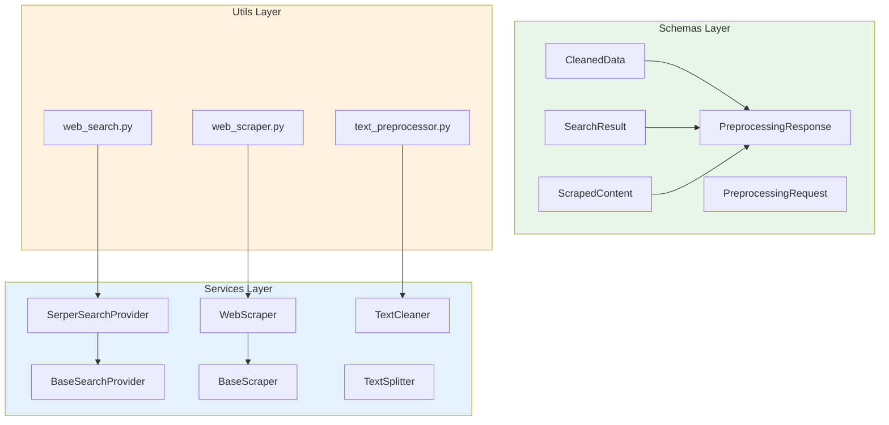

# 數據檢索與前處理模組流程圖

本文檔描述了數據檢索與前處理模組的完整流程。

## 主流程圖



## 詳細流程圖（包含錯誤處理）



## 服務互動圖



## 錯誤處理流程圖



## 資料流程圖



## 模組架構圖



## 使用範例

```python
from src.services import SerperSearchProvider, WebScraper, TextCleaner
from src.schemas import CleanedData, PreprocessingRequest

# 初始化服務
search_provider = SerperSearchProvider(api_key="your-api-key")
scraper = WebScraper(timeout=30, verify_ssl=True)
cleaner = TextCleaner()

# 建立請求
request = PreprocessingRequest(
    company_name="台積電",
    company_url="https://www.tsmc.com",
    max_search_results=5
)

# 執行搜尋
urls = search_provider.search(
    query=f"{request.company_name} 公司介紹",
    max_results=request.max_search_results
)

# 爬取網頁
if urls:
    content = scraper.extract(urls[0])
else:
    content = scraper.extract(str(request.company_url))

# 清洗文字
cleaned_text = cleaner.clean_for_llm(content, max_length=5000)

# 建立 CleanedData
cleaned_data = CleanedData(
    title="台積電公司介紹",
    source_url=urls[0] if urls else request.company_url,
    content_text=cleaned_text
)

# 計算 token 數
cleaned_data.calculate_counts()

print(f"Token count: {cleaned_data.token_count}")
print(f"Word count: {cleaned_data.word_count}")
```
